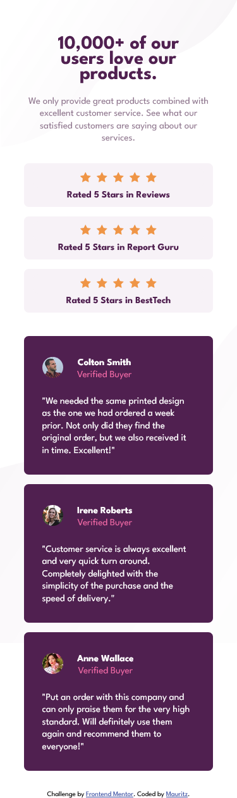
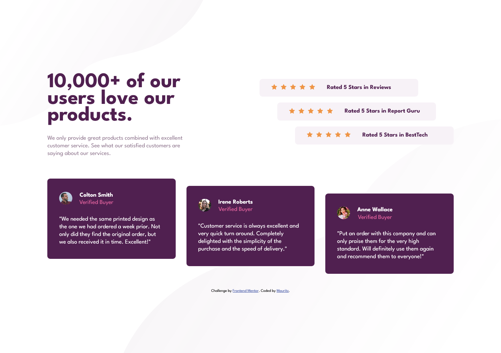

# Frontend Mentor - Social proof section solution

This is a solution to the [Social proof section challenge on Frontend Mentor](https://www.frontendmentor.io/challenges/social-proof-section-6e0qTv_bA). Frontend Mentor challenges help you improve your coding skills by building realistic projects. 

## Table of contents

- [Overview](#overview)
  - [The challenge](#the-challenge)
  - [Screenshot](#screenshot)
  - [Links](#links)
- [My process](#my-process)
  - [Built with](#built-with)
  - [What I learned](#what-i-learned)
  - [Continued development](#continued-development)
  - [Useful resources](#useful-resources)
- [Author](#author)

## Overview

### The challenge

Users should be able to:

- View the optimal layout for the section depending on their device's screen size

### Screenshot

### Links

- Solution URL: [Add solution URL here](https://your-solution-url.com)
- Live Site URL: [Add live site URL here](https://mauritzlm.github.io/social-proof-section/)

## My process

### Built with

- Semantic HTML5 markup
- CSS custom properties
- Flexbox
- Mobile-first workflow

### What I learned

This was a really fun challenge to practice with layout. I used a lot of flexbox. I learned that getting the structure of your html right is very important, because there are many boxes. One has to think through the problem and plan the structure one wants to use before starting to write code.

### Continued development

I want improve with building a layout, I feel I can improve a lot with flexbox and I want to get more comfortable with css grid.

I also want to learn more about writing good accessible html when you are dealing with a lot of elements and containing boxes.

### Useful resources

- [css tricks flexbox article](https://css-tricks.com/snippets/css/a-guide-to-flexbox/) - I like to refer to this article when using flexbox.

## Author

- Frontend Mentor - [@MauritzLM](https://www.frontendmentor.io/profile/MauritzLM)

